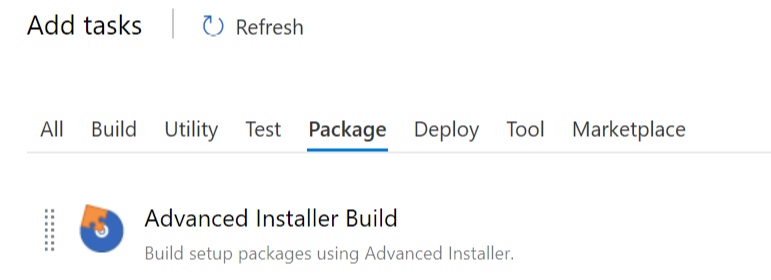
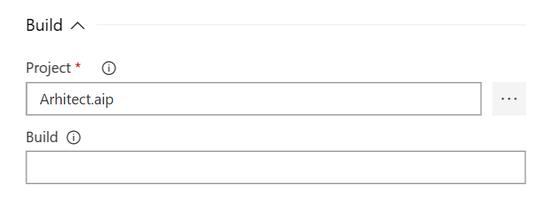
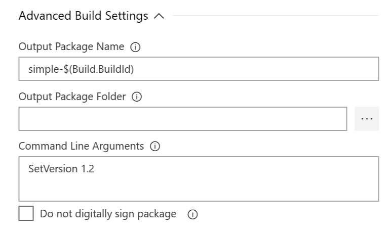
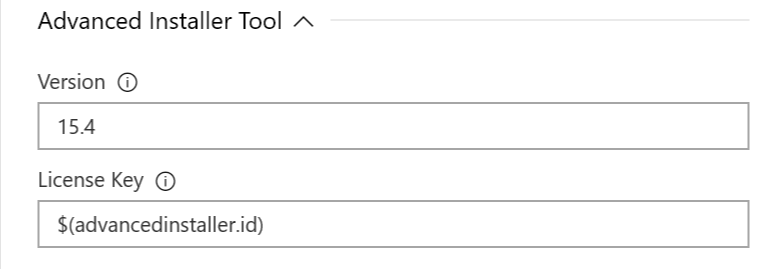

# Advanced Installer

Businesses around the globe, large and small, save hundreds of hours and thousands of dollars by taking advantage of the expert knowledge built into Advanced Installer to create Windows Installer packages and patches for their products.

# How to use 

The AI Build Task allows you to create a custom build step for TFS and Azure DevOPs.

## Step 1 - Add Task

The **Advanced Installer Build** task is located under the **Package** category.

## Step 2 - Configure Task

### Build Group

* **Project** - The AIP project to be built. All resources needed by the project file must be added to the repository, relative to the AIP.

* **Build** - Configure which build from the AIP to be performed. If none is specified **all** will be executed.

### Advanced Build Settings Group

Advanced configurations for build output.

* **Output Package Name** - The name of the result package.

* **Output Package Folder** - The location of the result package.

* **Command Line Arguments** - Additional edit commands to be performed. The changes are volatile and apply only to the current build. The AIP project file will not be modified. [Here](https://www.advancedinstaller.com/user-guide/command-line-editing.html) you can find a complete list.

* **Do not digitally sign package** - Disables digital signature for the current build. You might use this when creating debug packages.

### Advanced Installer Tool Group

Details about which version of Advanced Installer should be downloaded and cached on the build agent.

* **Version** - Version that should be cached. You can find a complete list [here](https://www.advancedinstaller.com/version-history.html). If no version is specified the latest will be used. This step will be skipped if a manual installation is detected. Such may be the case in TFS environments where you may want to use a pre-configure build agent.

* **License Key** - The license id that should be used for registration. **Simple** project types don't require a license.

# Tutorials

Check them out:
* [How-To: Build an Advanced Installer Visual Studio Project from Azure DevOps](https://www.advancedinstaller.com/visual-studio-project-from-azure-devops-pipeline.html)
* [Automation x2: How to automate Azure DevOps pipelines with Advanced Installer PowerShell automation](https://www.advancedinstaller.com/azure-devops-pipeline-powershell-automation.html)
* [How to: Choose Which Advanced Installer Azure DevOps Task You Need?](https://www.advancedinstaller.com/azure-devops-tasks.html)
* [How to configure digital signing in Advanced Installer Azure DevOps Task](https://www.advancedinstaller.com/azure-devops-configure-digital-signature.html)
