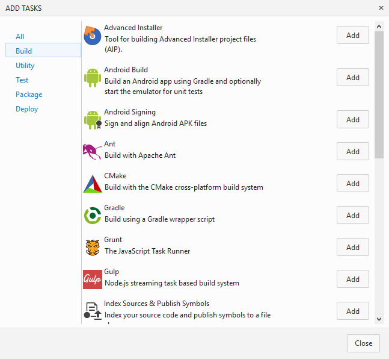
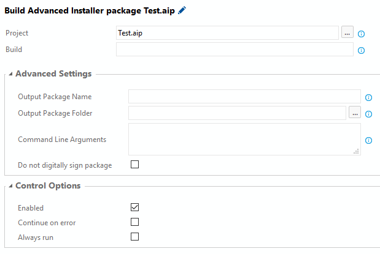

# Advanced Installer

Businesses around the globe, large and small, save hundreds of hours and thousands of dollars by taking advantage of the expert knowledge built into Advanced Installer to create Windows Installer packages and patches for their products.

# Requirements

This plugin requires [Advanced Installer](http://www.advancedinstaller.com/) to perform the build. Depending on your platform, there are two ways to do this:
* VSTS : Use the [Advanced Installer Tool Installer](https://marketplace.visualstudio.com/items?itemName=caphyon.AdvancedInstallerTool)
* TFS: Since [Tool Installer]((https://www.visualstudio.com/en-us/docs/build/concepts/process/tasks#tool-installers) tasks are not currently supported on TFS you must manually [download](http://www.advancedinstaller.com/download.html) and install Advanced Installer on the build host machine. 

# How to use 

The AI Build Task allows you to create a custom build step for TFS and VSTS. 

